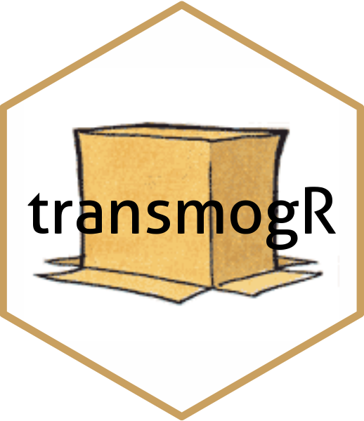

# transmogR 

<!-- badges: start -->

<!-- badges: end -->

This package contains functions for creating a variant-modified, or mogrified, 
reference genome or transcriptome.
SNPs, Insertions and Deletions are all supported.

With a generous tip of the hat and deep appreciation to Bill Watterson. 
Results are expected to be more predictable than for prototype transmogrifiers.
