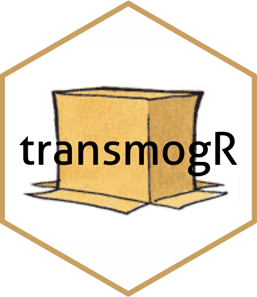

# transmogR 

This package contains functions for creating a variant-modified
reference genome or transcriptome. SNPs, Insertions and Deletions are
all supported.

With a generous tip of the hat and deep appreciation to Bill Watterson.
Results are expected to be more predictable than for prototype
transmogrifiers.

To install the stable version of `transmogR` from Bioconductor please
try the following.

``` r

if (!require("BiocManager")) {
  install.packages("BiocManager")
}
BiocManager::install("transmogR")
```

Alternatively, the latest build can be installed using

``` r

if (!require("BiocManager")) {
  install.packages("BiocManager")
}
BiocManager::install("smped/transmogR")
```
